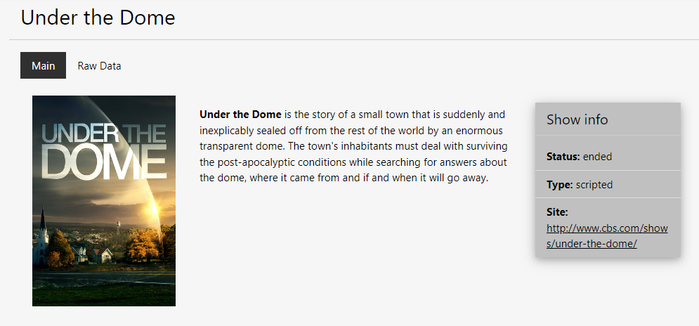
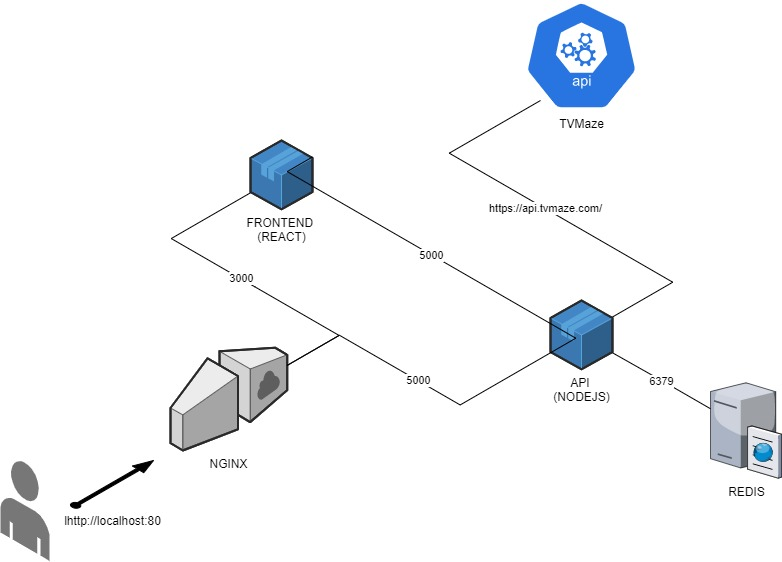

#   TVMaze API listing using React

### 
    {
        author: Guilherme Maron
    ,   email:  guilherme.maron@zoolengineering.se
    }

A little React implementation to access TVMaze ([http://tvmaze.com](http://tvmaze.com)) API

# How to access it online

[Clicking Here](http://tvmaze-env.eba-xbq9kt2p.us-east-1.elasticbeanstalk.com/) will take you to an AWS-based hosted version 
of this project. The main difference is that a Elasticache Redis instance is used instead of a local one.

# How to get the code

### `git clone https://github.com/GuiMaron/tvmaze.git`

Go into the cloned directory `tvmaze`

# How to run with Docker ([http://docker.com](docker.com))

**Development environment**

###  `docker-compose -f docker-compose-dev.yml up`

And access it in the browser
### [http://localhost](http://localhost)

To restart it

###  `docker-compose -f docker-compose-dev.yml down && docker-compose -f docker-compose-dev.yml up --build`

**Production environment (not really setup, only built)**

###  `docker-compose up`

And access it in the browser
### [http://localhost](http://localhost)

#   How to find a show that is not an 404?

Search for `Dome`, 

the show with `id = 1`, named `Under the Dome`, for example, will lend in a Show Details page.

#   Architecture

A simple architecture, with a client-facing NGINX
We have 2 important services, the `frontend` running a React application and the `api` running a NodeJS application
To cache the requests to the API a `redis` service is used

#   Time

I spent around 20 hours in this project

In the 5 hours span I was able to fetch the full schedule from the API and display it in the Search view, but without 
caching or the possibility of viewing individual shows.

#   Struggles
I had some problems with the `docker-compose.yml` files, and `.env` files to, some nasty invisible characters have sneaked in and made me lose a lot of time trying to fix it.

A lot have changed in some JS Libraryes since I worked with it for real the lasrt time, around one and half a year ago. 
Some re-learnig was needed (`redis` and `react-router-dom` specially).

#   If I had more time?
Well, if I had even more time I would improve this points first

-   writing tests, I already set up the tests container, but wrote none
-   rewriting the `api` in typescript
-   changing the approach to manage the shows, moving from the `ShowsController` to a `Show` based class
-   improve loggin
-   sanitizing user
-   general visual improvement
-   putting more info on the `ShowView`, it has 2 pages in `development` mode and only 1 in `production` mode
-   would use a database and make the favorite shows list
-   attack all the `TO-DO`s in the code
